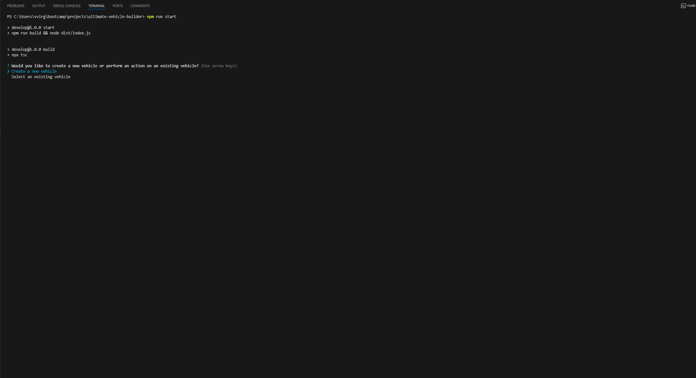
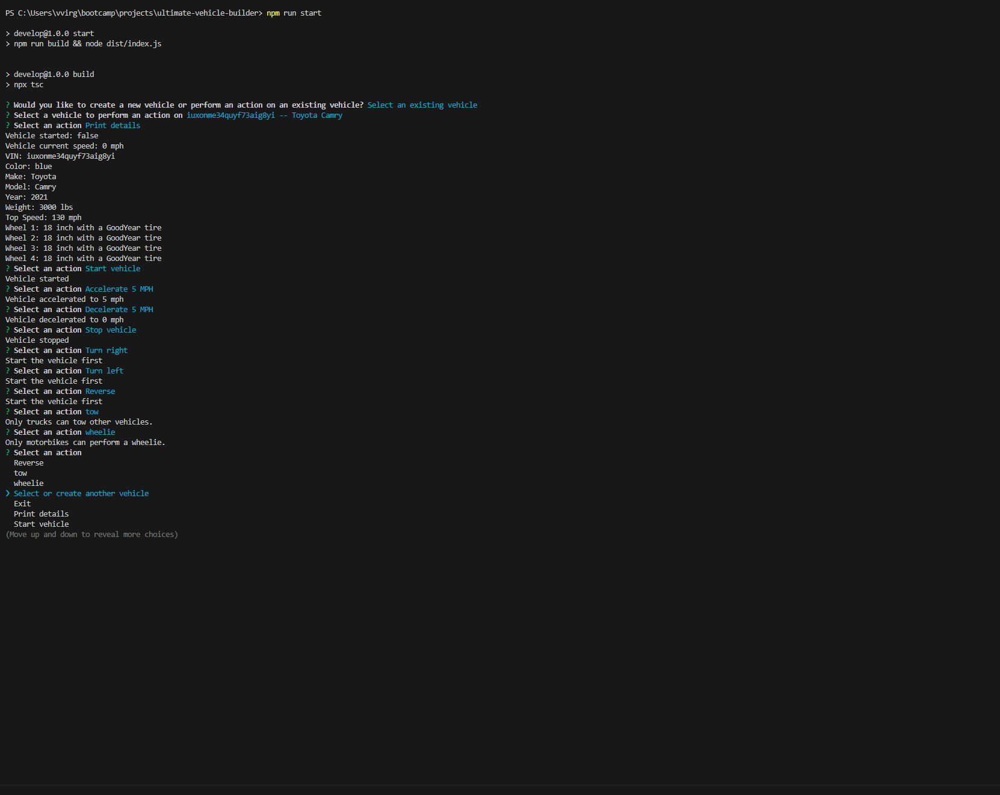
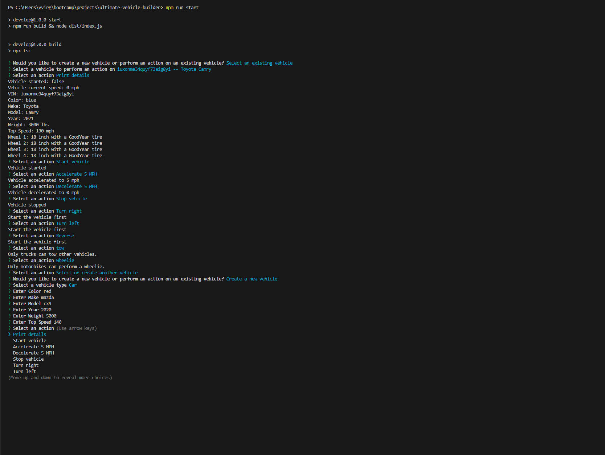
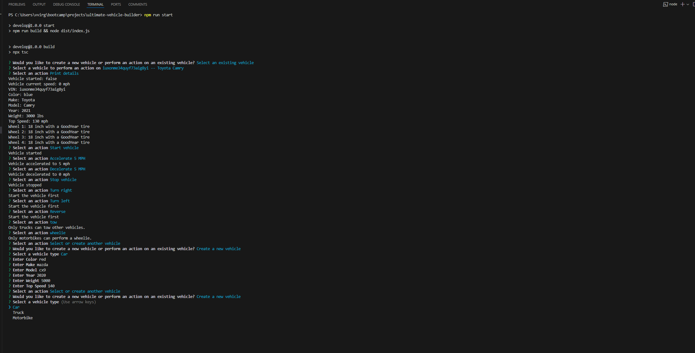

# ultimate-vehicle-builder
The Ultimate Vehicle Builder is an application prompts the user to create a new vehicle or select an existing vehicle. 


## The Application

After going through the creation process or the selection process, the user is able to perform certain actions with the selected vehicle. The user is returned to the actions menu after each action until they decide to exit the application.

```bash
APPLICATION 
 npm start
```

### Update to Application
The task is to update an existing TypeScript command-line application that builds and uses cars to have additional options for motorbikes and trucks. 


## Walkthrough

The link below will guide you how to use the Ultimate Vehicle Builder

### Video Walkthrough

[Video](./assets/UltimateVehicleBuilder.mp4) 

[Google drive video alternative](https://drive.google.com/file/d/1N3pH1GrW_v87WoVmZ4xofoRnXPZAH94u/view?usp=sharing)

### Screenshot
The following images demonstrates the application's appearance and functionality:

Result









© 2024 lenworth425 Confidential and Proprietary. All Rights Reserved.6